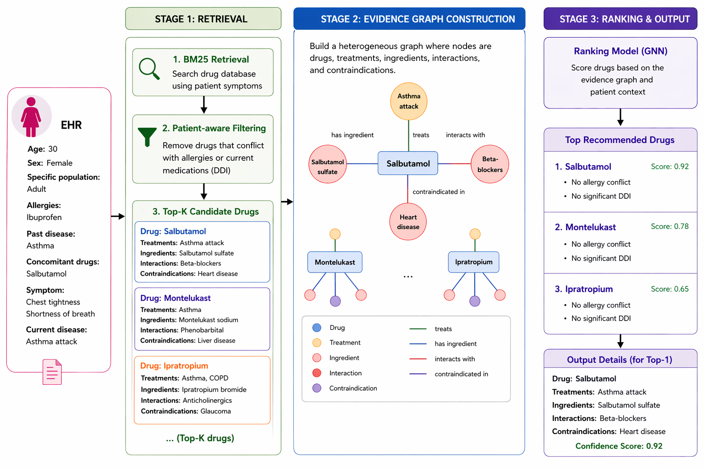

# Robust Medication Recommendation System (IntelliRx)

## 1. Overview

IntelliRx is an intelligent medication recommendation system designed to assist healthcare professionals in selecting safe and effective drug combinations.

The system leverages Medical Knowledge Graphs and Graph Neural Networks (GNNs), combined with a patient-aware mechanism, to model relationships between patients, diseases, and medications.

The system aims to:

* Improve recommendation accuracy
* Reduce harmful Drug–Drug Interactions (DDIs)
* Provide explainable and traceable recommendations

The implementation is based on the TraceDR framework.

---

## 2. Repository Structure

IntelliRx/
├── README.md
├── requirements.txt
├── .gitignore
├── data/
│   ├── raw/
│   ├── processed/
├── preprocessing/
│   └── preprocess.py
├── retrieval/
│   └── bm25.py
├── model/
│   ├── gnn.py
│   ├── attention.py
│   └── train.py
├── evaluation/
│   └── metrics.py
├── utils/
│   └── helpers.py
├── notebooks/
│   └── experiments.ipynb
└── results/
└── outputs/

---

## 3. System Architecture



The system follows a three-stage pipeline:

**Stage 1: Retrieval**
Patient data is used to retrieve candidate drugs using a BM25-based method.

**Stage 2: Evidence Graph Construction**
A graph is constructed to represent relationships between drugs, treatments, ingredients, interactions, and contraindications.

**Stage 3: Ranking and Output**
A Graph Neural Network (GNN) ranks the candidate drugs and generates the final recommendations.

---

## 4. Getting Started

### Prerequisites

* Python 3.8 or higher
* Anaconda
* Minimum 16 GB RAM
* Git installed

---

### Clone the Repository

```id="r1"
git clone https://github.com/your-repo/IntelliRx.git
cd IntelliRx
```

---

### Install Dependencies

```id="r2"
pip install -r requirements.txt
```

---

## 5. Dataset

Dataset is available at:

[Download Dataset](https://onedrive.live.com/?redeem=aHR0cHM6Ly8xZHJ2Lm1zL3UvYy8zZjZjZWE5NjRhZjFkNzUwL0lRQ1p4bEdoZkhUVFFKWExLZ2VFTkZmN0FUVThUTUQwTmNMOFlVc0lNX1ZWNkZBP2U9WG9NSFBT&cid=3F6CEA964AF1D750&id=3F6CEA964AF1D750%21sa151c699747c40d395cb2a07843457fb&parId=3F6CEA964AF1D750%21sea8cc6beffdb43d7976fbc7da445c639&o=OneUp)

After downloading, place the files inside:

data/raw/

---

## 6. Running the Pipeline

Step 1: Preprocessing
python preprocessing/preprocess.py

Step 2: Retrieval
python retrieval/bm25.py

Step 3: Training
python model/train.py

Step 4: Evaluation
python evaluation/metrics.py

---

## 7. Evaluation

The system pipeline was successfully executed. However, performance results were affected by dataset alignment issues and hardware limitations.

---

## 8. Future Work

* Improve retrieval performance
* Enhance ranking accuracy
* Use larger datasets
* Improve model performance

---

## 9. Security Notes

* API keys should be stored securely
* No sensitive patient data is stored

---

## 10. Team

* Noora Mohsen – Project Manager
* Maryam Ali – System Developer
* Sara Nael Al Zaben – Research & Analysis
* Amna Almazrouei – Documentation
